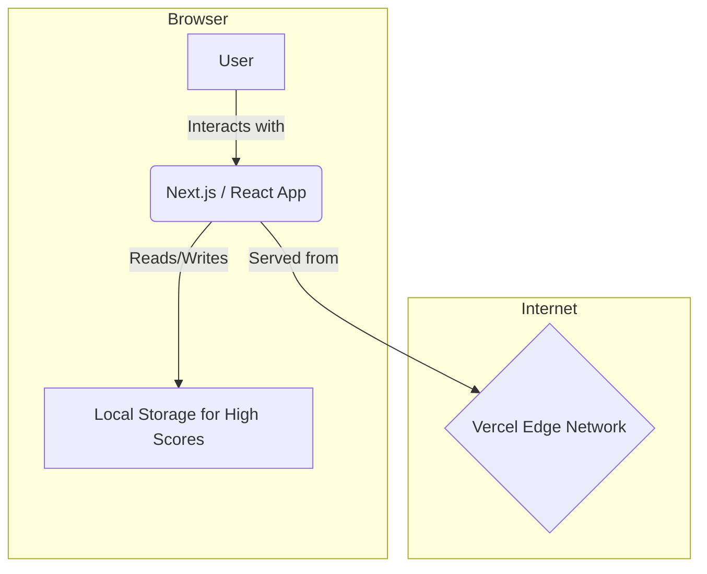
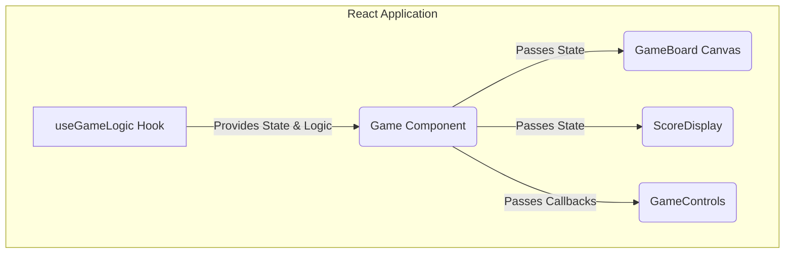
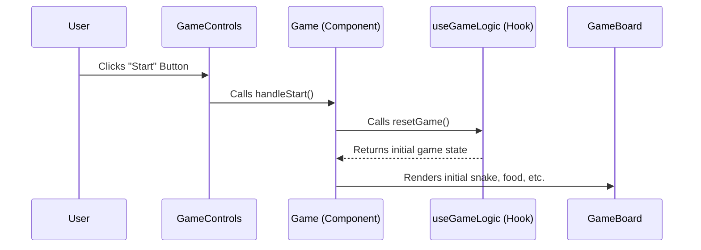
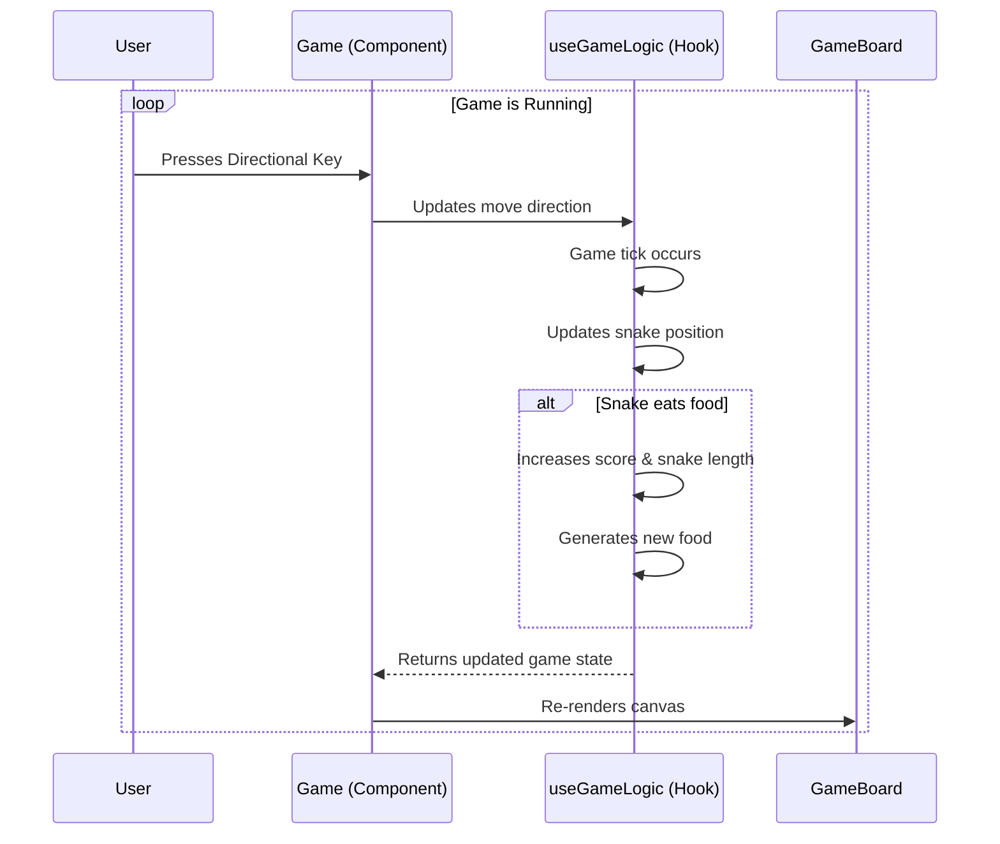
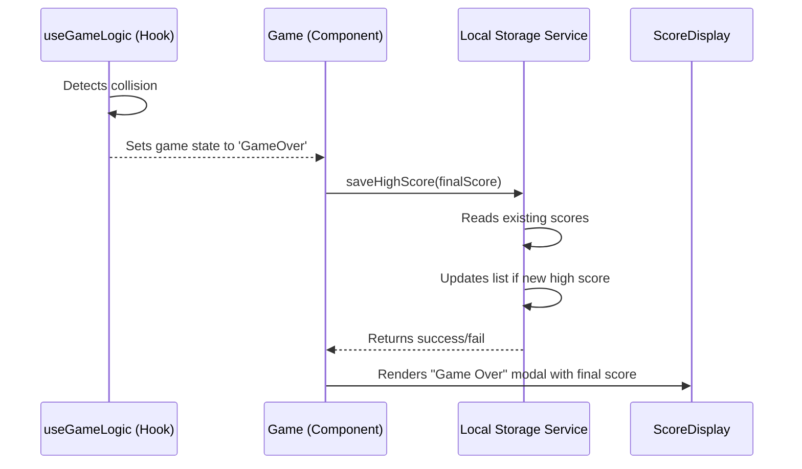

I apologize if the formatting was not rendered correctly. I will provide the complete, fully detailed Architecture Document again, enclosed in a single block for easy copying.

---

````markdown
# Modern Snake Game Fullstack Architecture Document

_Version 1.0 (2025-07-24)_

## 1. Introduction

This document outlines the complete fullstack architecture for the Modern Snake Game. It serves as the single source of truth for AI-driven development, ensuring consistency across the entire technology stack.

### Starter Template or Existing Project

The architecture will be based on the standard **`create-next-app`** template. This provides a solid, unopinionated foundation for our project.

### Change Log

| Date       | Version | Description                   | Author              |
| :--------- | :------ | :---------------------------- | :------------------ |
| 2025-07-24 | 1.0     | Initial architecture creation | Winston (Architect) |

## 2. High Level Architecture

### Technical Summary

This project will be a modern, serverless web application built on the **Jamstack architecture**. The user will interact with a static, highly-performant frontend generated by **Next.js** and hosted on **Vercel's Edge Network**. All game logic and state management will be handled client-side within the React framework. Instead of a traditional backend database, high score persistence will be achieved by utilizing the browser's **Local Storage**, making this a self-contained, frontend-only application.

### Platform and Infrastructure Choice

- **Platform**: **Vercel**
- **Key Services**: Vercel Hosting, Vercel Analytics.
- **Deployment Host and Regions**: Global Edge Network.

### Repository Structure

- **Structure**: **Monorepo**. The standard `create-next-app` structure creates a single-package application which functions as a simple and effective monorepo for this project's scope.

### High Level Architecture Diagram


````

## 3\. Tech Stack

| Category               | Technology            | Version | Purpose                                       | Rationale                                            |
| :--------------------- | :-------------------- | :------ | :-------------------------------------------- | :--------------------------------------------------- |
| **Frontend Language**  | TypeScript            | \~5.4   | Adds static typing for code quality.          | Industry standard for modern React/Next.js.          |
| **Frontend Framework** | Next.js               | \~14.2  | Provides the core application structure.      | Powerful and popular React framework.                |
| **UI Library**         | Shadcn UI             | \~0.8   | Provides accessible and reusable components.  | Modern aesthetic and deep integration with Tailwind. |
| **State Management**   | React Hooks           | 18+     | Manages the game's state.                     | Sufficient for the app's complexity.                 |
| **Database**           | Browser Local Storage | N/A     | Persists personal high scores.                | Simplifies the architecture to be frontend-only.     |
| **Frontend Testing**   | Jest & RTL            | \~29    | For unit and component testing.               | Standard testing suite for Next.js.                  |
| **Styling**            | Tailwind CSS          | \~3.4   | For utility-first styling.                    | Works seamlessly with Shadcn UI.                     |
| **CI/CD & Hosting**    | Vercel                | N/A     | Automates build/deployment and hosts the app. | Most optimized platform for Next.js.                 |
| **Monitoring**         | Vercel Analytics      | N/A     | Provides traffic and performance insights.    | Built-in to the Vercel platform.                     |

## 4\. Data Models

### Model: LeaderboardEntry

- **Purpose**: To represent a single high score entry.
- **Key Attributes**: `score: number`, `date: string`.
- **TypeScript Interface**:
  ```typescript
  interface LeaderboardEntry {
    score: number;
    date: string;
  }
  ```

The full leaderboard will be stored as an array: `LeaderboardEntry[]`.

## 5\. API & External Integrations

- **API Specification**: Not applicable, as the project is frontend-only.
- **External APIs**: Not required for this project.

## 6\. Components

### Logical Component Breakdown

1.  **`useGameLogic` (Custom Hook)**: The "brain" of the game, managing state and logic.
2.  **`Game` (Parent Component)**: Orchestrates the application and passes state to children.
3.  **`GameBoard` (Canvas Component)**: Renders the snake and food on the canvas.
4.  **`ScoreDisplay` (UI Component)**: Displays the score and leaderboard.
5.  **`GameControls` (UI Component)**: Renders the UI buttons (Start, Pause, etc.).

### Component Relationship Diagram



## 7\. Core Workflows & Detailed Epics/Stories

This section details the primary user workflows as sequence diagrams and the full breakdown of all epics and stories for the MVP.

### Workflow: Starting a New Game



### Workflow: Gameplay Loop



### Workflow: Game Over and Saving Score



### Epic 1: Foundational Gameplay & Core Mechanics

**Goal**: To implement the core, playable snake game on a desktop browser, including player controls, movement, food consumption, and score tracking.

#### Story 1.1: Set Up Project and Game Canvas

**As a** developer,
**I want** to set up the Next.js project and render a basic game canvas,
**so that** I have a foundational structure and a visible area to build the game within.

**Acceptance Criteria:**

1.  A new Next.js project is initialized with TypeScript and Tailwind CSS.
2.  An HTML5 `<canvas>` element is rendered on the main page.
3.  The canvas has a visible border and a fixed grid-based dimension (e.g., 20x20 cells).
4.  A basic game loop is running, clearing and redrawing the canvas on each frame (e.g., at 60fps).

#### Story 1.2: Implement the Snake

**As a** player,
**I want** to see a snake on the game board that moves automatically,
**so that** the primary game character is present and functional.

**Acceptance Criteria:**

1.  A snake, composed of one or more segments, is rendered on the canvas at a starting position.
2.  The snake moves automatically in a single direction (e.g., right) at a constant speed, one grid cell at a time.
3.  The snake's position is correctly updated within the game's state on each movement tick.

#### Story 1.3: Add Player Controls

**As a** player,
**I want** to control the snake's direction using the keyboard,
**so that** I can navigate the game board and interact with the game.

**Acceptance Criteria:**

1.  Pressing the Arrow Keys (Up, Down, Left, Right) or WASD keys changes the snake's direction of movement.
2.  The snake cannot immediately reverse its direction (e.g., if moving right, the left key is ignored).
3.  The control inputs are responsive and accurately reflected in the snake's next movement.

#### Story 1.4: Implement Food and Snake Growth

**As a** player,
**I want** the snake to eat food and grow longer,
**so that** the core game mechanic and challenge is in place.

**Acceptance Criteria:**

1.  A single piece of food is rendered at a random, valid position on the canvas.
2.  When the snake's head segment collides with the food, the snake's length increases by one segment.
3.  After the food is consumed, a new piece of food appears at a new random, valid position.
4.  The new food does not appear on a grid cell currently occupied by the snake.

#### Story 1.5: Implement Score Tracking

**As a** player,
**I want** to see my score increase as I eat food,
**so that** I have a clear goal and can track my progress.

**Acceptance Criteria:**

1.  The game starts with a score of 0.
2.  The score is visibly displayed on the screen outside of the game canvas.
3.  Each time the snake consumes a piece of food, the score increments by a fixed amount (e.g., 10 points).
4.  The displayed score updates in real-time.

### Epic 2: Full Game Experience & Responsive UI

**Goal**: To build a complete and polished user experience around the core game, including state management (start, pause, game over), and to ensure the entire application is fully responsive and playable on mobile devices.

#### Story 2.1: Implement Game State Screens

**As a** player,
**I want** to see clear start and game-over screens,
**so that** I have a complete and understandable game loop from beginning to end.

**Acceptance Criteria:**

1.  A "Start Screen" is displayed before the game begins, showing the game title and a "Start Game" button.
2.  A "Game Over" screen (or modal) is displayed when the snake collides with a wall or itself.
3.  The "Game Over" screen displays the player's final score.
4.  The "Game Over" screen includes a "Restart" button.
5.  These screens are built using reusable Shadcn UI components where appropriate (e.g., Button, Card).

#### Story 2.2: Implement Game State Logic

**As a** player,
**I want** the game to properly start, pause, and end,
**so that** I can manage my gameplay session effectively.

**Acceptance Criteria:**

1.  Clicking the "Start Game" button on the Start Screen initiates the game.
2.  The game can be paused (e.g., by pressing the 'P' key or a pause button) and resumed.
3.  When paused, the game freezes, and a "Paused" indicator is displayed.
4.  The "game over" condition (collision) correctly stops the game and triggers the "Game Over" screen.
5.  Clicking the "Restart" button on the "Game Over" screen resets the game to its initial state for a new session.

#### Story 2.3: Implement Responsive UI Layout

**As a** player,
**I want** the game and surrounding UI to adapt to my screen size,
**so that** I can have a great experience on either desktop or mobile.

**Acceptance Criteria:**

1.  The game canvas and UI elements (score, buttons) resize and reflow gracefully for common mobile, tablet, and desktop screen widths.
2.  The layout is visually appealing and functional on a small mobile viewport (e.g., 375px width).
3.  The layout does not break or become unusable on large desktop screens.
4.  Tailwind CSS's responsive design features (`sm:`, `md:`, `lg:`) are used to achieve responsiveness.

#### Story 2.4: Add Mobile Touch Controls

**As a** player,
**I want** to control the snake on my mobile device using touch,
**so that** the game is fully playable on a touchscreen.

**Acceptance Criteria:**

1.  Swiping up, down, left, or right on the game canvas changes the snake's direction.
2.  The touch controls are responsive and do not have significant input lag.
3.  The snake cannot be reversed into itself via a swipe, similar to the keyboard controls.
4.  Touch controls do not interfere with UI buttons outside the game canvas.

### Epic 3: Persistent Leaderboard & Final Polish

**Goal**: To add the high score persistence feature using Local Storage, allowing users to see their personal top scores, and to perform a final polish of the complete application.

#### Story 3.1: Save High Score to Local Storage

**As a** player,
**I want** my high score to be saved when my game ends,
**so that** my best achievements are remembered for future sessions.

**Acceptance Criteria:**

1.  When a game ends, the final score is compared against the list of high scores stored in Local Storage.
2.  If Local Storage contains fewer than 3 scores, the new score is added to the list.
3.  If the new score is higher than any of the existing top 3 scores, it replaces the lowest score in the list.
4.  The high score list in Local Storage is correctly sorted, with the highest score first.
5.  The data is stored in a structured format (e.g., JSON) in Local Storage under a clear key (e.g., `snake-leaderboard`).

#### Story 3.2: Read and Display Leaderboard

**As a** player,
**I want** to see the list of high scores,
**so that** I can see what I am aiming to beat.

**Acceptance Criteria:**

1.  When the application first loads, it checks Local Storage for any saved high scores.
2.  The retrieved high scores are displayed on the "Start Screen".
3.  The updated leaderboard, including the player's most recent score if it's a new high score, is displayed on the "Game Over" screen.
4.  If no scores are present in Local Storage, the leaderboard displays a default message (e.g., "No high scores yet\!").

#### Story 3.3: Final Polish and Refinement

**As a** developer,
**I want** to perform a final review and cleanup of the application,
**so that** the final product is bug-free, visually polished, and the code is clean for portfolio review.

**Acceptance Criteria:**

1.  All UI components are visually aligned and consistent with the Shadcn UI aesthetic across all game states and screen sizes.
2.  Any known minor bugs or visual glitches are resolved.
3.  Code is reviewed for clarity, commented where necessary, and unused code is removed.
4.  The project's `README.md` file is updated with instructions on how to run and play the game.

## 8\. Database Schema

- **Technology**: Browser Local Storage
- **Key**: `snake-leaderboard`
- **Format**: A JSON string representing an array of `LeaderboardEntry` objects.
- **Example**: `"[{\"score\":150,\"date\":\"...\"}]"`

Of course. Here are the fully detailed sections 9 through 17 of the Architecture Document.

---

## 9. Frontend Architecture

This section provides the critical next layer of detail for implementation. It establishes clear, modern patterns for file organization, a template for creating React components, a defined shape for our game's state, and a dedicated service for handling all Local Storage interactions.

#### **Component Architecture**

##### **Component Organization**

The project will follow the standard Next.js App Router structure. All reusable components will be co-located within a `/components` directory, subdivided by feature or type.

```plaintext
app/
├── components/
│   ├── game/
│   │   ├── GameBoard.tsx
│   │   └── GameControls.tsx
│   └── ui/
│       ├── ScoreDisplay.tsx
│       └── Leaderboard.tsx
├── lib/
│   ├── hooks/
│   │   └── useGameLogic.ts
│   └── leaderboard.ts
└── page.tsx      (The main Game component will live here)
```

##### **Component Template**

All new React components must follow this basic functional component template with TypeScript props.

```typescript
import React from "react";

type MyComponentProps = {
  // Define component props here
  title: string;
};

const MyComponent = ({ title }: MyComponentProps) => {
  return (
    <div>
      <h1>{title}</h1>
      {/* Component JSX goes here */}
    </div>
  );
};

export default MyComponent;
```

#### **State Management Architecture**

##### **State Structure**

The core game state, managed within the `useGameLogic` hook, will adhere to a defined interface for type safety.

```typescript
interface GameState {
  snake: { x: number; y: number }[];
  food: { x: number; y: number };
  score: number;
  direction: "UP" | "DOWN" | "LEFT" | "RIGHT";
  isPaused: boolean;
  isGameOver: boolean;
}
```

##### **State Management Patterns**

- The primary state object (`GameState`) will be managed by a `useReducer` hook within `useGameLogic.ts` for predictable state transitions.
- Simple UI state (e.g., modal visibility) can be handled by `useState` hooks within individual components.

#### **Routing Architecture**

This is a single-page application. All primary UI will be rendered within the root route: `app/page.tsx`. No complex routing is required for the MVP.

#### **Local Storage Service**

To keep Local Storage interactions clean and isolated, we will use a dedicated utility file.

##### **Service Definition (`lib/leaderboard.ts`)**

This file will contain all functions for interacting with the leaderboard data in Local Storage.

```typescript
import { LeaderboardEntry } from "./types"; // Assuming types are defined

const LEADERBOARD_KEY = "snake-leaderboard";

export const getScores = (): LeaderboardEntry[] => {
  const data = localStorage.getItem(LEADERBOARD_KEY);
  return data ? JSON.parse(data) : [];
};

export const saveScore = (newScore: number): void => {
  const scores = getScores();
  // Logic to add new score and keep only top 3
  const updatedScores = [
    ...scores,
    { score: newScore, date: new Date().toISOString() },
  ]
    .sort((a, b) => b.score - a.score)
    .slice(0, 3);
  localStorage.setItem(LEADERBOARD_KEY, JSON.stringify(updatedScores));
};
```

---

## 10. Backend & Unified Structure

- **Backend Architecture**: Not applicable, as the project is frontend-only.
- **Unified Project Structure**: The structure defined in the Frontend Architecture section is sufficient for this project's scope.

---

## 11. Development Workflow

#### **Local Development Setup**

##### **Prerequisites**

- Node.js (LTS version, e.g., 20.x)
- npm, yarn, or pnpm

##### **Initial Setup**

1.  **Create the Next.js project:**
    ```bash
    npx create-next-app@latest snake-game-portfolio
    ```
2.  **Navigate into the project directory:**
    ```bash
    cd snake-game-portfolio
    ```
3.  **Initialize Shadcn UI:**
    ```bash
    npx shadcn-ui@latest init
    ```
4.  **Install necessary Shadcn components:**
    ```bash
    npx shadcn-ui@latest add button card dialog table badge
    ```

##### **Development Commands**

- **Start the development server:** `npm run dev`
- **Create a production build:** `npm run build`
- **Run the production build locally:** `npm run start`
- **Run tests:** `npm run test`

#### **Environment Configuration**

For the MVP, no environment variables (`.env` file) are required, as there are no backend API keys or secrets to manage.

---

## 12. Deployment Architecture

#### **Deployment Strategy**

We will use a **Git-based deployment workflow**. The project's GitHub repository will be linked to a Vercel project. Vercel will automatically build and deploy the application upon every push to the repository.

- **Production Deployment**: Every push or merge to the `main` branch will automatically trigger a build and deploy to the production URL.
- **Preview Deployment**: Every push to any other branch or any new pull request will automatically trigger a build and deploy to a unique preview URL.

#### **CI/CD Pipeline**

We will use **Vercel's built-in CI/CD pipeline**. No separate configuration file is required. Vercel automatically detects the Next.js framework and runs the standard `npm run build` command, along with optimizations.

#### **Environments**

| Environment     | Frontend URL                                 | Purpose                                           |
| :-------------- | :------------------------------------------- | :------------------------------------------------ |
| **Production**  | `snake-game-portfolio.vercel.app` (Example)  | Live application, connected to the `main` branch. |
| **Preview**     | `[branch-name]-project.vercel.app` (Example) | Staging environment for testing new features.     |
| **Development** | `localhost:3000`                             | Local machine for active development.             |

---

## 13. Security and Performance

#### **Security Requirements**

- **XSS Prevention**: We will rely on React's native data binding and JSX syntax, which automatically sanitizes content to prevent Cross-Site Scripting (XSS) attacks.
- **Dependency Security**: The development process will include running `npm audit` regularly to identify and patch vulnerabilities.
- **Secure Headers**: Basic security headers will be applied automatically by Vercel during deployment.

#### **Performance Optimization**

- **Bundle Size**: We will leverage Next.js's automatic code splitting to keep the initial JavaScript bundle small.
- **Loading Strategy**: The application will be statically rendered by Next.js, resulting in a highly optimized, fast-loading initial page.
- **Canvas Performance**: The game loop and rendering logic will be optimized to ensure minimal re-renders and efficient drawing on the canvas to maintain a smooth 60fps.

---

## 14. Testing Strategy

#### **Testing Pyramid**

Our approach will focus heavily on unit and component tests. End-to-end (E2E) tests are out of scope for the MVP.

```plaintext
      /      \
     /________\    Integration Tests (Component Interactions)
    /          \
   /____________\  Unit Tests (Hooks, Utils) & Component Tests (UI Rendering)
```

#### **Test Organization**

Test files (`*.test.tsx`) will be co-located with the components and logic they are testing, following standard Next.js and Jest conventions.

#### **Frontend Component Test (Conceptual Example)**

```typescript
import { render, screen } from "@testing-library/react";
import ScoreDisplay from "./components/ui/ScoreDisplay";

describe("ScoreDisplay", () => {
  it("should render the score correctly", () => {
    // Arrange
    const score = 120;
    render(<ScoreDisplay currentScore={score} />);

    // Act
    const scoreElement = screen.getByText(/Score: 120/i);

    // Assert
    expect(scoreElement).toBeInTheDocument();
  });
});
```

---

## 15. Coding Standards

#### **Critical Rules**

- **State Logic in Hooks**: All core game logic **must** reside within the `useGameLogic` custom hook. React components should remain "dumb".
- **Centralized Persistence**: All interactions with Local Storage **must** go through the dedicated service file (`lib/leaderboard.ts`).
- **Styling System**: All styling **must** be done using Tailwind CSS utility classes and Shadcn UI components.
- **State Immutability**: The game state object **must** be treated as immutable.

#### **Naming Conventions**

| Element        | Convention              | Example           |
| :------------- | :---------------------- | :---------------- |
| **Components** | PascalCase              | `GameBoard.tsx`   |
| **Hooks**      | camelCase, `use` prefix | `useGameLogic.ts` |
| **Utilities**  | camelCase               | `leaderboard.ts`  |

---

## 16. Error Handling Strategy

- **React Error Boundaries**: A global Error Boundary component will be wrapped around the main `Game` component to catch any unexpected rendering errors and display a user-friendly message.
- **Local Storage**: All functions within the `lib/leaderboard.ts` service will be wrapped in `try...catch` blocks. On failure, they will log the error and return a state that allows the UI to degrade gracefully (e.g., hiding the leaderboard) without crashing the game.

---

## 17. Monitoring and Observability

#### **Monitoring Stack**

- **Performance Monitoring**: **Vercel Analytics** will be enabled to automatically provide Core Web Vitals and traffic insights.
- **Error Tracking**: We will integrate a free-tier **Sentry** account to capture and report any unhandled JavaScript errors.
- **Logging**: All logging will be directed to the browser's console.

#### **Key Metrics**

- **Frontend Performance**: Monitor the Core Web Vitals provided by Vercel Analytics.
- **JavaScript Errors**: Track the number and frequency of uncaught errors via Sentry.
