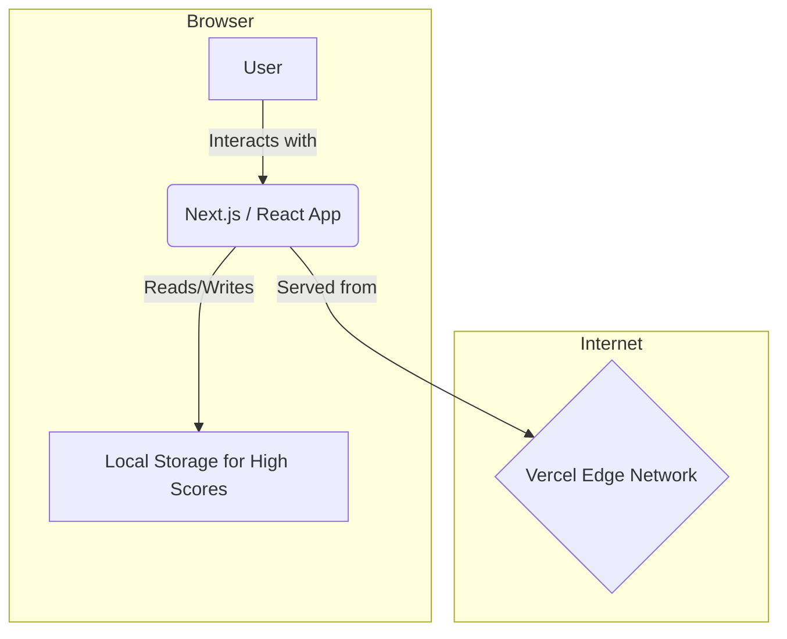

# 2. High Level Architecture

## Technical Summary

This project will be a modern, serverless web application built on the **Jamstack architecture**. The user will interact with a static, highly-performant frontend generated by **Next.js** and hosted on **Vercel's Edge Network**. All game logic and state management will be handled client-side within the React framework. Instead of a traditional backend database, high score persistence will be achieved by utilizing the browser's **Local Storage**, making this a self-contained, frontend-only application.

## Platform and Infrastructure Choice

- **Platform**: **Vercel**
- **Key Services**: Vercel Hosting, Vercel Analytics.
- **Deployment Host and Regions**: Global Edge Network.

## Repository Structure

- **Structure**: **Monorepo**. The standard `create-next-app` structure creates a single-package application which functions as a simple and effective monorepo for this project's scope.

## High Level Architecture Diagram


````
