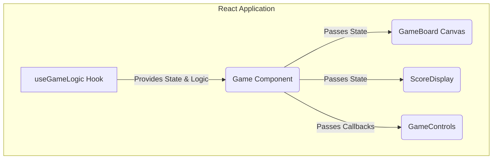

# 6\. Components

## Logical Component Breakdown

1.  **`useGameLogic` (Custom Hook)**: The "brain" of the game, managing state and logic.
2.  **`Game` (Parent Component)**: Orchestrates the application and passes state to children.
3.  **`GameBoard` (Canvas Component)**: Renders the snake and food on the canvas.
4.  **`ScoreDisplay` (UI Component)**: Displays the score and leaderboard.
5.  **`GameControls` (UI Component)**: Renders the UI buttons (Start, Pause, etc.).

## Component Relationship Diagram

