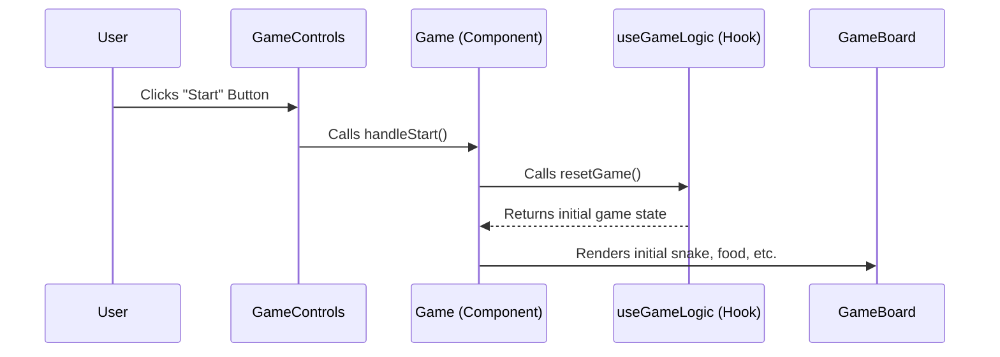
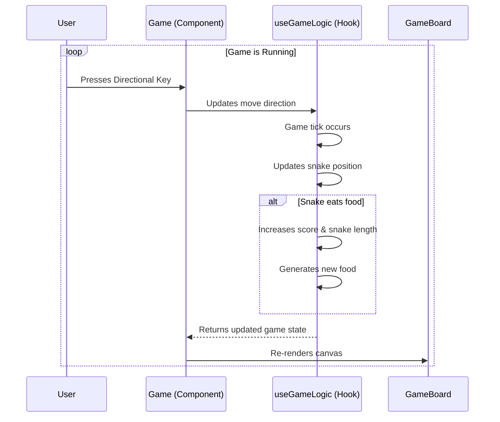
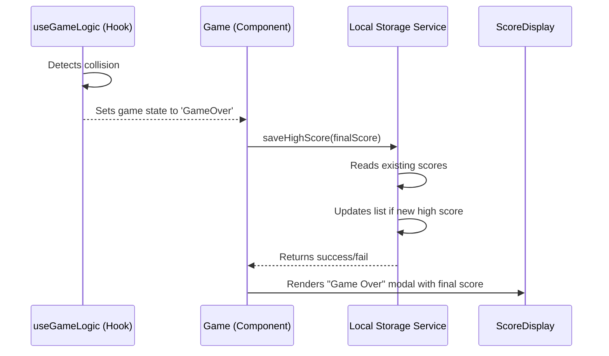

# 7\. Core Workflows & Detailed Epics/Stories

This section details the primary user workflows as sequence diagrams and the full breakdown of all epics and stories for the MVP.

## Workflow: Starting a New Game

## Workflow: Gameplay Loop

## Workflow: Game Over and Saving Score

## Epic 1: Foundational Gameplay & Core Mechanics

**Goal**: To implement the core, playable snake game on a desktop browser, including player controls, movement, food consumption, and score tracking.

### Story 1.1: Set Up Project and Game Canvas

**As a** developer,
**I want** to set up the Next.js project and render a basic game canvas,
**so that** I have a foundational structure and a visible area to build the game within.

**Acceptance Criteria:**

1.  A new Next.js project is initialized with TypeScript and Tailwind CSS.
2.  An HTML5 `<canvas>` element is rendered on the main page.
3.  The canvas has a visible border and a fixed grid-based dimension (e.g., 20x20 cells).
4.  A basic game loop is running, clearing and redrawing the canvas on each frame (e.g., at 60fps).

### Story 1.2: Implement the Snake

**As a** player,
**I want** to see a snake on the game board that moves automatically,
**so that** the primary game character is present and functional.

**Acceptance Criteria:**

1.  A snake, composed of one or more segments, is rendered on the canvas at a starting position.
2.  The snake moves automatically in a single direction (e.g., right) at a constant speed, one grid cell at a time.
3.  The snake's position is correctly updated within the game's state on each movement tick.

### Story 1.3: Add Player Controls

**As a** player,
**I want** to control the snake's direction using the keyboard,
**so that** I can navigate the game board and interact with the game.

**Acceptance Criteria:**

1.  Pressing the Arrow Keys (Up, Down, Left, Right) or WASD keys changes the snake's direction of movement.
2.  The snake cannot immediately reverse its direction (e.g., if moving right, the left key is ignored).
3.  The control inputs are responsive and accurately reflected in the snake's next movement.

### Story 1.4: Implement Food and Snake Growth

**As a** player,
**I want** the snake to eat food and grow longer,
**so that** the core game mechanic and challenge is in place.

**Acceptance Criteria:**

1.  A single piece of food is rendered at a random, valid position on the canvas.
2.  When the snake's head segment collides with the food, the snake's length increases by one segment.
3.  After the food is consumed, a new piece of food appears at a new random, valid position.
4.  The new food does not appear on a grid cell currently occupied by the snake.

### Story 1.5: Implement Score Tracking

**As a** player,
**I want** to see my score increase as I eat food,
**so that** I have a clear goal and can track my progress.

**Acceptance Criteria:**

1.  The game starts with a score of 0.
2.  The score is visibly displayed on the screen outside of the game canvas.
3.  Each time the snake consumes a piece of food, the score increments by a fixed amount (e.g., 10 points).
4.  The displayed score updates in real-time.

## Epic 2: Full Game Experience & Responsive UI

**Goal**: To build a complete and polished user experience around the core game, including state management (start, pause, game over), and to ensure the entire application is fully responsive and playable on mobile devices.

### Story 2.1: Implement Game State Screens

**As a** player,
**I want** to see clear start and game-over screens,
**so that** I have a complete and understandable game loop from beginning to end.

**Acceptance Criteria:**

1.  A "Start Screen" is displayed before the game begins, showing the game title and a "Start Game" button.
2.  A "Game Over" screen (or modal) is displayed when the snake collides with a wall or itself.
3.  The "Game Over" screen displays the player's final score.
4.  The "Game Over" screen includes a "Restart" button.
5.  These screens are built using reusable Shadcn UI components where appropriate (e.g., Button, Card).

### Story 2.2: Implement Game State Logic

**As a** player,
**I want** the game to properly start, pause, and end,
**so that** I can manage my gameplay session effectively.

**Acceptance Criteria:**

1.  Clicking the "Start Game" button on the Start Screen initiates the game.
2.  The game can be paused (e.g., by pressing the 'P' key or a pause button) and resumed.
3.  When paused, the game freezes, and a "Paused" indicator is displayed.
4.  The "game over" condition (collision) correctly stops the game and triggers the "Game Over" screen.
5.  Clicking the "Restart" button on the "Game Over" screen resets the game to its initial state for a new session.

### Story 2.3: Implement Responsive UI Layout

**As a** player,
**I want** the game and surrounding UI to adapt to my screen size,
**so that** I can have a great experience on either desktop or mobile.

**Acceptance Criteria:**

1.  The game canvas and UI elements (score, buttons) resize and reflow gracefully for common mobile, tablet, and desktop screen widths.
2.  The layout is visually appealing and functional on a small mobile viewport (e.g., 375px width).
3.  The layout does not break or become unusable on large desktop screens.
4.  Tailwind CSS's responsive design features (`sm:`, `md:`, `lg:`) are used to achieve responsiveness.

### Story 2.4: Add Mobile Touch Controls

**As a** player,
**I want** to control the snake on my mobile device using touch,
**so that** the game is fully playable on a touchscreen.

**Acceptance Criteria:**

1.  Swiping up, down, left, or right on the game canvas changes the snake's direction.
2.  The touch controls are responsive and do not have significant input lag.
3.  The snake cannot be reversed into itself via a swipe, similar to the keyboard controls.
4.  Touch controls do not interfere with UI buttons outside the game canvas.

## Epic 3: Persistent Leaderboard & Final Polish

**Goal**: To add the high score persistence feature using Local Storage, allowing users to see their personal top scores, and to perform a final polish of the complete application.

### Story 3.1: Save High Score to Local Storage

**As a** player,
**I want** my high score to be saved when my game ends,
**so that** my best achievements are remembered for future sessions.

**Acceptance Criteria:**

1.  When a game ends, the final score is compared against the list of high scores stored in Local Storage.
2.  If Local Storage contains fewer than 3 scores, the new score is added to the list.
3.  If the new score is higher than any of the existing top 3 scores, it replaces the lowest score in the list.
4.  The high score list in Local Storage is correctly sorted, with the highest score first.
5.  The data is stored in a structured format (e.g., JSON) in Local Storage under a clear key (e.g., `snake-leaderboard`).

### Story 3.2: Read and Display Leaderboard

**As a** player,
**I want** to see the list of high scores,
**so that** I can see what I am aiming to beat.

**Acceptance Criteria:**

1.  When the application first loads, it checks Local Storage for any saved high scores.
2.  The retrieved high scores are displayed on the "Start Screen".
3.  The updated leaderboard, including the player's most recent score if it's a new high score, is displayed on the "Game Over" screen.
4.  If no scores are present in Local Storage, the leaderboard displays a default message (e.g., "No high scores yet\!").

### Story 3.3: Final Polish and Refinement

**As a** developer,
**I want** to perform a final review and cleanup of the application,
**so that** the final product is bug-free, visually polished, and the code is clean for portfolio review.

**Acceptance Criteria:**

1.  All UI components are visually aligned and consistent with the Shadcn UI aesthetic across all game states and screen sizes.
2.  Any known minor bugs or visual glitches are resolved.
3.  Code is reviewed for clarity, commented where necessary, and unused code is removed.
4.  The project's `README.md` file is updated with instructions on how to run and play the game.
