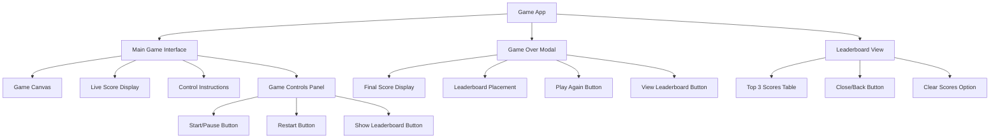
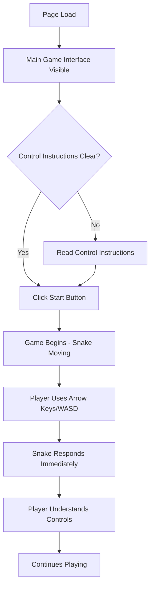
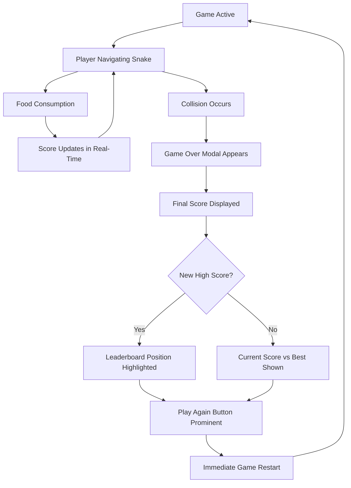
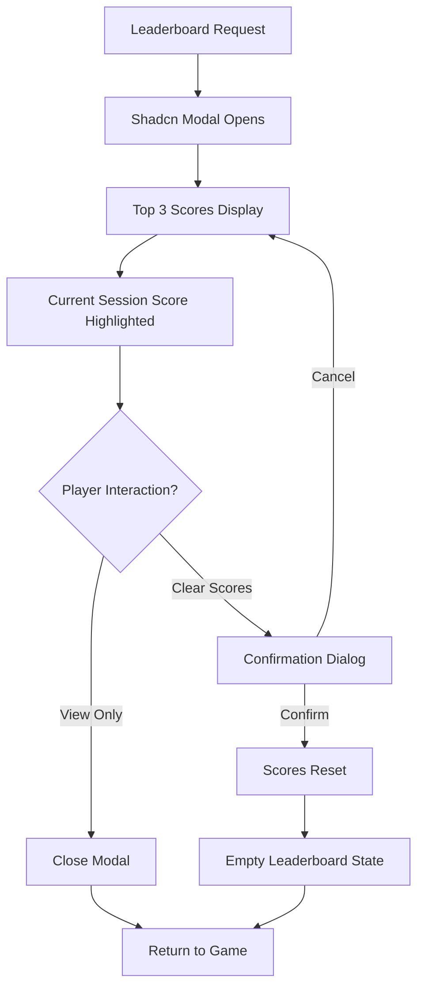

# Snake Game Web App UI/UX Specification

## Introduction

This document defines the user experience goals, information architecture, user flows, and visual design specifications for the Snake Game Web App's user interface. It serves as the foundation for visual design and frontend development, ensuring a cohesive, portfolio-worthy user experience that demonstrates modern design system usage.

### Overall UX Goals & Principles

#### Target User Personas

**Portfolio Reviewers**: Technical recruiters, potential employers, fellow developers who need to quickly assess technical capabilities through immediate visual and interactive demonstration.

**Casual Players**: Web users encountering the game through portfolio or sharing who expect smooth, intuitive gameplay without learning curve.

#### Usability Goals

**Immediate Comprehension**: Portfolio viewers understand the technical implementation quality within 10 seconds of interaction

**Effortless Engagement**: New players can start playing within 5 seconds without reading instructions

**Professional Impression**: Interface demonstrates attention to detail and modern frontend development practices

**Cross-Device Consistency**: Identical quality experience whether accessed on mobile during a commute or desktop during an interview

#### Design Principles

1. **Clarity over cleverness** - Prioritize clear communication of functionality over aesthetic innovation
2. **Component system showcase** - Demonstrate effective Shadcn/ui usage throughout the interface
3. **Responsive-first thinking** - Design for mobile constraints, enhance for desktop capabilities
4. **Accessibility by default** - Keyboard navigation and screen reader support built into every interaction
5. **Performance-conscious design** - Visual choices support 60fps gameplay and fast load times

### Change Log

| Date  | Version | Description                          | Author    |
| ----- | ------- | ------------------------------------ | --------- |
| Today | 1.0     | Initial UI/UX specification creation | UX Expert |

## Information Architecture (IA)

### Site Map / Screen Inventory

### Navigation Structure

**Primary Navigation:** Single-page application with modal/overlay patterns for secondary views

- Main game screen serves as the primary interface
- Game Over modal appears contextually after gameplay ends
- Leaderboard accessible via button from main screen or game over modal

**Secondary Navigation:** Action-based navigation through Shadcn/ui buttons and modals

- Start/Pause/Restart controls within main interface
- Modal-based overlay for leaderboard (non-disruptive to game state)
- Clear navigation back to main game from all secondary views

**Breadcrumb Strategy:** Not applicable - simple single-level navigation with clear context

The navigation remains intentionally minimal to focus attention on the game while providing easy access to leaderboard functionality that demonstrates data persistence capabilities.

## User Flows

### First-Time Player Experience

**User Goal:** Understand and start playing the game immediately

**Entry Points:** Direct URL access, portfolio link, social sharing

**Success Criteria:** Playing the game within 5 seconds of page load

#### Flow Diagram

#### Edge Cases & Error Handling:

- **Slow Loading**: Progressive loading with Shadcn skeleton components during initial canvas setup
- **Mobile First Visit**: Touch control explanation overlay appears automatically
- **Keyboard Focus Issues**: Clear focus indicators on all interactive Shadcn components
- **Canvas Not Supported**: Graceful fallback message with browser upgrade suggestions

**Notes:** Interface uses Shadcn card component to frame game area and Shadcn button components for all interactive elements, ensuring consistent visual language.

### Gameplay Session Flow

**User Goal:** Play multiple rounds to achieve high scores

**Entry Points:** After first game or returning player

**Success Criteria:** Seamless game restart and score improvement motivation

#### Flow Diagram

#### Edge Cases & Error Handling:

- **Accidental Key Press**: Pause function accessible via spacebar to prevent accidental exits
- **Score Calculation Error**: Graceful fallback to previous valid score state
- **Local Storage Full**: Clear notification with option to reset leaderboard
- **Game State Corruption**: Automatic game restart with preserved leaderboard data

**Notes:** Game Over modal uses Shadcn dialog component with clear hierarchy - score display using Shadcn typography variants and action buttons using consistent Shadcn button patterns.

### Leaderboard Interaction Flow

**User Goal:** View personal progress and competitive context

**Entry Points:** Game Over modal, main interface leaderboard button

**Success Criteria:** Quick view of top scores with clear personal achievement context

#### Flow Diagram

#### Edge Cases & Error Handling:

- **Empty Leaderboard**: Encouraging empty state message with call-to-action to play first game
- **Local Storage Access Error**: Fallback to session-only scoring with clear notification
- **Data Corruption**: Graceful reset with user notification and confirmation
- **Modal Focus Trap**: Proper keyboard navigation within modal using Shadcn accessibility features

**Notes:** Leaderboard uses Shadcn table component for score display with proper ranking indicators and Shadcn badge components for position highlighting. Clear action buttons for reset functionality.

## Wireframes & Mockups

### Design Files

**Primary Design Files:** To be created using Figma or similar tool based on these specifications. For a portfolio project, wireframes and component specifications provided here may be sufficient for implementation.

### Key Screen Layouts

#### Main Game Screen

**Purpose:** Primary gameplay interface showcasing clean design and functional game controls

**Key Elements:**

- Shadcn Card component as main container with subtle border and padding
- HTML5 Canvas centered within the card for game area
- Shadcn Typography components for score display and instructions
- Shadcn Button components for game controls (Start, Pause, Restart)
- Responsive grid layout using Tailwind classes for mobile adaptation

**Interaction Notes:** All interactive elements use Shadcn focus styles and hover states. Canvas maintains aspect ratio across screen sizes with Tailwind responsive utilities.

**Design File Reference:** Main game interface showing desktop and mobile layouts with Shadcn component specifications

#### Game Over Modal

**Purpose:** Contextual overlay displaying game results and next actions without losing game state

**Key Elements:**

- Shadcn Dialog component with proper backdrop and focus management
- Shadcn Typography for score display with emphasized final score using proper text hierarchy
- Shadcn Badge components for leaderboard position indicators (1st, 2nd, 3rd)
- Shadcn Button variants (primary for "Play Again", secondary for "View Leaderboard")
- Responsive modal sizing that works on mobile devices

**Interaction Notes:** Modal appears with smooth animation using Shadcn transitions. Keyboard navigation trapped within modal. Clear close affordances with escape key support.

**Design File Reference:** Game over modal showing score presentation and leaderboard integration patterns

#### Leaderboard View

**Purpose:** Display persistent high scores demonstrating local storage integration

**Key Elements:**

- Shadcn Dialog component for modal presentation (or Card if inline)
- Shadcn Table component for clean score presentation with proper column headers
- Shadcn Badge components for ranking indicators with appropriate color variants
- Empty state using Shadcn Typography and subtle iconography when no scores exist
- Shadcn Button for clear scores functionality with destructive variant styling

**Interaction Notes:** Table rows highlight current session score if applicable. Clear scores function includes confirmation dialog using nested Shadcn AlertDialog component.

**Design File Reference:** Leaderboard layout showing both populated and empty states with proper component hierarchy

#### Mobile Touch Controls Layout

**Purpose:** Adaptive interface for mobile gameplay without compromising desktop experience

**Key Elements:**

- Shadcn Card component repositioned for thumb accessibility
- Virtual directional buttons using Shadcn Button with appropriate icons from Lucide React
- Larger touch targets meeting accessibility standards (44px minimum)
- Condensed score display using smaller Shadcn Typography variants
- Swipe gesture support for secondary actions

**Interaction Notes:** Touch controls appear only on mobile breakpoints using Tailwind responsive classes. Haptic feedback through vibration API where supported.

**Design File Reference:** Mobile-specific layout showing touch control placement and responsive adaptations

## Component Library / Design System

### Design System Approach

**Design System Approach:** Leverage Shadcn/ui as the foundational component library with selective customization to maintain portfolio professionalism while demonstrating effective design system usage. This approach showcases understanding of modern component-driven development and design consistency.

### Core Components

#### Game Container Component

**Purpose:** Primary wrapper for all game-related content providing consistent spacing and visual hierarchy

**Variants:**

- Default: Main game interface container
- Modal: Overlay dialogs for game over and leaderboard

**States:**

- Default: Standard game state
- Paused: Dimmed overlay indicating paused gameplay
- Game Over: Highlighted border or shadow for completed game state

**Usage Guidelines:** Use Card component from Shadcn/ui with consistent padding (p-6) and shadow (shadow-lg). Maintain responsive behavior with proper mobile adaptations.

#### Score Display Component

**Purpose:** Real-time score presentation with clear visual hierarchy and responsive typography

**Variants:**

- Live Score: Prominent display during gameplay using Shadcn Typography
- Final Score: Emphasized presentation in game over modal
- Leaderboard Score: Tabular format with ranking indicators

**States:**

- Active: Real-time updating during gameplay
- Static: Final score display
- Highlighted: New high score or current session emphasis

**Usage Guidelines:** Use Shadcn Typography components with proper semantic hierarchy (h1 for final scores, h2 for live scores, h3 for leaderboard entries). Include Shadcn Badge components for score rankings.

#### Game Control Component

**Purpose:** Interactive elements for game state management with consistent button patterns

**Variants:**

- Primary Action: Start/Play Again using Shadcn Button primary variant
- Secondary Action: Pause/View Leaderboard using secondary variant
- Destructive Action: Restart/Clear Scores using destructive variant

**States:**

- Default: Standard interactive state
- Active: Currently engaged (pause button during gameplay)
- Disabled: Unavailable actions with proper visual feedback
- Loading: Brief loading states for game initialization

**Usage Guidelines:** Maintain consistent button sizing (default size for desktop, sm for mobile). Use proper Shadcn Button variants to communicate action hierarchy. Include keyboard shortcuts where appropriate.

#### Leaderboard Table Component

**Purpose:** Structured presentation of high scores demonstrating data persistence and clean table design

**Variants:**

- Standard: Full leaderboard with all scores
- Compact: Top 3 display for space-constrained views
- Empty State: Encouraging first-play messaging

**States:**

- Populated: Standard table with score data
- Loading: Skeleton states during local storage access
- Empty: First-time user or cleared scores state
- Error: Graceful fallback for storage access issues

**Usage Guidelines:** Use Shadcn Table component with proper column headers (Rank, Score, Date). Include Shadcn Badge components for position indicators. Maintain responsive table behavior using Tailwind responsive utilities.

#### Mobile Touch Control Component

**Purpose:** Touch-friendly directional controls for mobile gameplay without compromising desktop experience

**Variants:**

- Directional Pad: Four-way control using Shadcn Button with icons
- Gesture Zone: Swipe-sensitive area for alternative control method
- Action Buttons: Game controls adapted for touch interaction

**States:**

- Visible: Active on mobile breakpoints only
- Hidden: Desktop and tablet landscape orientations
- Pressed: Clear visual feedback for touch interactions

**Usage Guidelines:** Use Shadcn Button components with Lucide React icons for directional indicators. Ensure 44px minimum touch targets. Position using fixed positioning for consistent thumb accessibility.

## Branding & Style Guide

### Visual Identity

**Brand Guidelines:** Modern, clean aesthetic leveraging Shadcn/ui's default design system with minimal customization to maintain professional portfolio presentation while showcasing effective design system implementation.

### Color Palette

| Color Type | Hex Code                 | Usage                                                   |
| ---------- | ------------------------ | ------------------------------------------------------- |
| Primary    | `hsl(222.2 84% 4.9%)`    | Primary buttons, focus states, active game elements     |
| Secondary  | `hsl(210 40% 96%)`       | Secondary buttons, inactive states, background elements |
| Accent     | `hsl(221.2 83.2% 53.3%)` | Interactive highlights, score emphasis, new records     |
| Success    | `hsl(142.1 76.2% 36.3%)` | Positive feedback, successful actions, high scores      |
| Warning    | `hsl(38.4 92.1% 50.4%)`  | Cautions, pause states, important notices               |
| Error      | `hsl(0 84.2% 60.2%)`     | Game over states, destructive actions, error messages   |
| Neutral    | `hsl(210 40% 98%)`       | Text, borders, subtle backgrounds, game canvas border   |

**Note:** These colors follow Shadcn/ui's default palette using CSS custom properties, ensuring consistency with the design system and easy maintenance.

### Typography

#### Font Families

- **Primary:** `Inter` (Shadcn/ui default) - Clean, modern sans-serif for all interface text
- **Secondary:** `system-ui` fallback - Ensures consistent rendering across platforms
- **Monospace:** `ui-monospace` - For score displays requiring fixed-width alignment

#### Type Scale

| Element | Size               | Weight                | Line Height       |
| ------- | ------------------ | --------------------- | ----------------- |
| H1      | `text-4xl` (36px)  | `font-bold` (700)     | `leading-tight`   |
| H2      | `text-2xl` (24px)  | `font-semibold` (600) | `leading-tight`   |
| H3      | `text-xl` (20px)   | `font-semibold` (600) | `leading-snug`    |
| Body    | `text-base` (16px) | `font-normal` (400)   | `leading-relaxed` |
| Small   | `text-sm` (14px)   | `font-normal` (400)   | `leading-normal`  |

**Usage Examples:**

- **Game Over Modal Title:** H1 with primary color for maximum impact
- **Live Score Display:** H2 with monospace font for consistent number width
- **Control Instructions:** Body text with muted foreground color
- **Leaderboard Rankings:** H3 for score values, Small for timestamps

### Iconography

**Icon Library:** Lucide React (integrated with Shadcn/ui ecosystem)

**Usage Guidelines:** Consistent 16px (w-4 h-4) icons for buttons, 24px (w-6 h-6) for prominent actions, maintaining visual hierarchy and touch target accessibility.

**Key Icons:**

- **Play:** `Play` icon for start/resume actions
- **Pause:** `Pause` icon for game pause functionality
- **RotateCcw:** `RotateCcw` icon for restart actions
- **Trophy:** `Trophy` icon for leaderboard and high scores
- **ChevronUp/Down/Left/Right:** Directional icons for mobile touch controls

### Spacing & Layout

**Grid System:** Tailwind CSS utilities with Shadcn/ui component spacing

**Base Spacing Unit:** 4px (Tailwind's default)

**Layout Spacing:**

- **Component Padding:** `p-6` (24px) for cards and containers
- **Button Spacing:** `px-4 py-2` for standard buttons, `px-6 py-3` for primary actions
- **Section Gaps:** `gap-4` (16px) between related elements, `gap-8` (32px) between sections
- **Canvas Margins:** `m-4` (16px) minimum margin around game canvas for breathing room

**Responsive Breakpoints:** Following Tailwind's default breakpoints

- **Mobile:** `< 640px` - Compact layout with larger touch targets
- **Tablet:** `640px - 1024px` - Intermediate spacing and component sizing
- **Desktop:** `> 1024px` - Full component spacing and optimal game canvas size

**Game-Specific Spacing:**

- **Canvas Container:** `aspect-square` or `aspect-[4/3]` maintaining consistent game area
- **Score Display:** `mb-4` separation from game canvas for clear hierarchy
- **Control Buttons:** `space-x-2` horizontal spacing for logical grouping

## Accessibility Requirements

### Compliance Target

**Standard:** WCAG 2.1 AA - Demonstrates professional accessibility knowledge and ensures inclusive design practices appropriate for portfolio presentation.

### Key Requirements

#### Visual

**Color contrast ratios:** All text meets WCAG AA standards with minimum 4.5:1 contrast ratio for normal text and 3:1 for large text. Shadcn/ui default palette provides compliant contrast ratios out of the box.

**Focus indicators:** All interactive elements display clear focus rings using Shadcn/ui's built-in focus-visible utilities. Custom focus styles maintain 2px minimum outline width with high contrast colors.

**Text sizing:** Responsive typography scales appropriately from 14px minimum on mobile to 16px+ on desktop. All text remains readable when zoomed to 200% without horizontal scrolling.

#### Interaction

**Keyboard navigation:** Complete game functionality accessible via keyboard:

- Arrow keys and WASD for snake movement
- Space bar for pause/resume functionality
- Tab navigation through all UI controls
- Enter/Space activation for buttons
- Escape key to close modals and return focus appropriately

**Screen reader support:** All interactive elements include proper ARIA labels and roles:

- Game canvas has aria-label describing current game state
- Live score updates announced via aria-live regions
- Modal dialogs properly trap focus and announce content
- Button purposes clearly communicated through accessible names

**Touch targets:** All interactive elements meet 44px minimum size requirement:

- Shadcn Button components default to appropriate sizing
- Mobile touch controls designed with 48px targets for comfortable interaction
- Adequate spacing between touch targets to prevent accidental activation

#### Content

**Alternative text:** All meaningful images and icons include descriptive alt text:

- Decorative icons marked with aria-hidden="true"
- Game state communicated through text announcements
- Score changes and game events announced to screen readers

**Heading structure:** Logical heading hierarchy maintains document outline:

- H1 for main game title
- H2 for major sections (Score, Leaderboard)
- H3 for subsections within modals
- No skipped heading levels throughout interface

**Form labels:** All interactive controls properly labeled:

- Buttons have clear, descriptive text or aria-label attributes
- Game controls include instructions and current state information
- Error messages clearly associated with relevant controls

### Testing Strategy

**Automated Testing:** Integration with accessibility testing tools during development:

- @axe-core/react for runtime accessibility checking
- Playwright accessibility assertions for E2E testing
- ESLint jsx-a11y plugin for development-time accessibility linting

**Manual Testing Procedures:**

- Keyboard-only navigation testing for all user flows
- Screen reader testing with NVDA/JAWS for Windows, VoiceOver for macOS
- High contrast mode testing to ensure visual elements remain distinguishable
- Zoom testing up to 200% for text scaling compliance

**Key Testing Scenarios:**

- Complete game session using only keyboard navigation
- Screen reader announcement testing for score changes and game state transitions
- Mobile touch navigation testing with assistive touch enabled
- Color blindness simulation testing for game element distinction

**Performance Accessibility:**

- Reduced motion preferences respected for game animations
- No auto-playing content that could trigger vestibular disorders
- Sufficient time provided for all user interactions without time pressure

## Responsiveness Strategy

### Breakpoints

| Breakpoint | Min Width | Max Width | Target Devices                             |
| ---------- | --------- | --------- | ------------------------------------------ |
| Mobile     | `0px`     | `639px`   | Smartphones, small mobile devices          |
| Tablet     | `640px`   | `1023px`  | Tablets, large phones in landscape         |
| Desktop    | `1024px`  | `1535px`  | Laptops, desktop monitors                  |
| Wide       | `1536px`  | `-`       | Large desktop monitors, ultrawide displays |

**Note:** Following Tailwind CSS default breakpoints for consistency with Shadcn/ui responsive patterns.

### Adaptation Patterns

#### Layout Changes

**Mobile (< 640px):**

- Single column layout with game canvas taking full container width
- Shadcn Card component uses minimal padding (`p-4` instead of `p-6`)
- Score display positioned above canvas for thumb accessibility
- Touch controls overlay positioned at bottom of screen
- Modal dialogs use nearly full screen width with minimal margins

**Tablet (640px - 1023px):**

- Game canvas maintains aspect ratio with centered positioning
- Side-by-side layout for score and controls when space permits
- Hybrid input support (both touch and potential keyboard)
- Modal dialogs use comfortable mid-size dimensions

**Desktop (1024px+):**

- Optimal game canvas size with comfortable surrounding whitespace
- Horizontal layout with score and controls positioned around canvas
- Full keyboard navigation prominence with visible focus indicators
- Modal dialogs use constrained widths for comfortable reading

#### Navigation Changes

**Mobile Navigation:**

- Touch-first interaction with virtual directional pad
- Swipe gesture support for secondary actions
- Shadcn Button components sized larger (`size="lg"`) for touch accessibility
- Game controls grouped in bottom panel for thumb reach

**Tablet Navigation:**

- Hybrid approach supporting both touch and keyboard input
- Touch controls available but less prominent than mobile
- Keyboard shortcuts displayed when hardware keyboard detected
- Flexible button sizing based on input method detection

**Desktop Navigation:**

- Keyboard-first interaction with clear focus management
- Mouse hover states fully utilized on Shadcn components
- Keyboard shortcuts prominently displayed
- Touch controls completely hidden using `hidden` utilities

#### Content Priority

**Mobile Content Hierarchy:**

1. Game canvas (primary focus, largest viewport allocation)
2. Current score (immediately visible above canvas)
3. Essential controls (Start/Pause/Restart)
4. Secondary actions (Leaderboard access via floating action button)

**Tablet Content Adaptation:**

- Game canvas remains primary but allows for peripheral content
- Score and controls positioned to not interfere with gameplay
- Leaderboard accessible via prominent button placement
- Instructions and help text become visible when space permits

**Desktop Content Expansion:**

- Full interface layout with all elements comfortably visible
- Comprehensive control instructions displayed permanently
- Leaderboard and game statistics can be shown in sidebar if desired
- Room for enhanced visual polish and micro-animations

#### Interaction Changes

**Mobile Interaction Patterns:**

- Touch controls overlay using fixed positioning
- Tap targets minimum 44px (achieved through Shadcn Button sizing)
- Swipe gestures for directional input as alternative to virtual buttons
- Modal interactions optimized for thumb navigation

**Tablet Interaction Flexibility:**

- Auto-detection of input method (touch vs keyboard) where possible
- Graceful degradation between touch and pointer interactions
- Shadcn components adapt hover states based on capability detection
- Focus management accounts for both input paradigms

**Desktop Interaction Optimization:**

- Full keyboard shortcut support with visual indicators
- Mouse hover enhancements on all interactive Shadcn components
- Focus trapping and management optimized for keyboard navigation
- Precise click targets with subtle hover feedback

**Game-Specific Responsive Considerations:**

- Canvas size scales proportionally while maintaining playable area
- Game speed and difficulty remain constant across devices
- Score font sizing adapts to screen real estate while maintaining readability
- Pause functionality accounts for different interaction contexts (accidental touches vs intentional breaks)

## Animation & Micro-interactions

### Motion Principles

**Subtle and Purposeful**: All animations serve functional purposes - providing feedback, guiding attention, or communicating state changes. Motion design should enhance the portfolio demonstration without distracting from core gameplay.

**Performance-Conscious**: All animations designed to maintain 60fps gameplay performance using CSS transforms and GPU acceleration. Leverages Shadcn/ui's built-in transition utilities for consistency.

**Accessible**: Respects `prefers-reduced-motion` settings and provides disable options for users sensitive to motion. Critical information never conveyed through animation alone.

### Key Animations

**Game State Transitions**: Smooth fade-in/fade-out for game over modal using Shadcn Dialog component animations (Duration: 200ms, Easing: ease-in-out)

**Score Updates**: Gentle scale animation when score increases to provide positive feedback (Duration: 150ms, Easing: ease-out)

**Button Interactions**: Shadcn Button hover and active states with subtle scale and shadow changes (Duration: 100ms, Easing: ease-in-out)

**Snake Movement**: Canvas-based smooth interpolation between grid positions for fluid 60fps movement (Duration: Frame-based, Easing: linear)

**Food Consumption**: Brief pulse animation when snake consumes food providing satisfying feedback (Duration: 200ms, Easing: ease-out)

**Modal Entrance**: Shadcn Dialog slide-up animation with backdrop fade for professional modal presentation (Duration: 250ms, Easing: ease-out)

**Focus Indicators**: Smooth focus ring transitions using Shadcn focus utilities for keyboard navigation (Duration: 150ms, Easing: ease-in-out)

**Loading States**: Shadcn Skeleton component animations for graceful loading experiences (Duration: 1500ms, Easing: ease-in-out infinite)

## Performance Considerations

### Performance Goals

**Page Load:** Initial render complete within 2 seconds on standard broadband connections with game ready to play within 3 seconds total.

**Interaction Response:** All button clicks and keyboard inputs provide immediate visual feedback within 16ms (single frame at 60fps).

**Animation FPS:** Maintain consistent 60fps for all game animations and UI transitions without frame drops during gameplay.

### Design Strategies

**Optimize Canvas Rendering**: Use efficient drawing techniques with minimal canvas state changes and batch operations where possible. Implement dirty rectangle optimization for game element updates.

**Leverage Shadcn Performance**: Utilize Shadcn/ui's optimized component implementations and built-in performance best practices. Components designed for minimal re-renders and efficient DOM updates.

**Progressive Enhancement**: Core game functionality works without JavaScript animations. Enhanced interactions layer on top for browsers with full capabilities.

**Asset Optimization**: Minimal external assets with focus on web fonts and Shadcn icons. No unnecessary images or graphics that could impact load performance.

**Code Splitting Strategy**: Game logic and UI components organized for optimal Next.js automatic code splitting. Critical rendering path prioritized for immediate gameplay availability.
