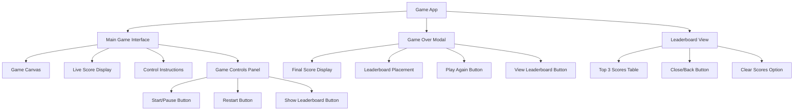

# Information Architecture (IA)

## Site Map / Screen Inventory

## Navigation Structure

**Primary Navigation:** Single-page application with modal/overlay patterns for secondary views

- Main game screen serves as the primary interface
- Game Over modal appears contextually after gameplay ends
- Leaderboard accessible via button from main screen or game over modal

**Secondary Navigation:** Action-based navigation through Shadcn/ui buttons and modals

- Start/Pause/Restart controls within main interface
- Modal-based overlay for leaderboard (non-disruptive to game state)
- Clear navigation back to main game from all secondary views

**Breadcrumb Strategy:** Not applicable - simple single-level navigation with clear context

The navigation remains intentionally minimal to focus attention on the game while providing easy access to leaderboard functionality that demonstrates data persistence capabilities.
