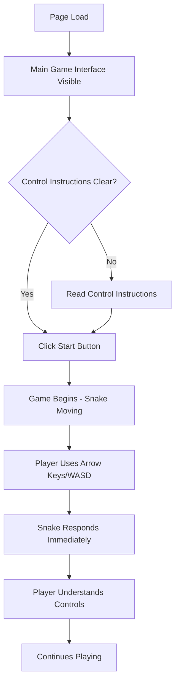
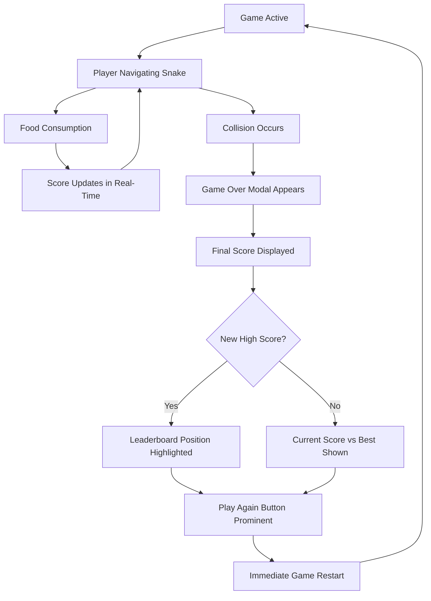
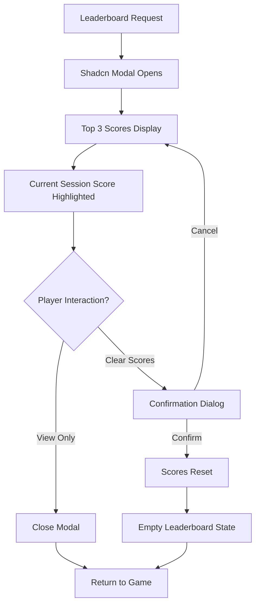

# User Flows

## First-Time Player Experience

**User Goal:** Understand and start playing the game immediately

**Entry Points:** Direct URL access, portfolio link, social sharing

**Success Criteria:** Playing the game within 5 seconds of page load

### Flow Diagram

### Edge Cases & Error Handling:

- **Slow Loading**: Progressive loading with Shadcn skeleton components during initial canvas setup
- **Mobile First Visit**: Touch control explanation overlay appears automatically
- **Keyboard Focus Issues**: Clear focus indicators on all interactive Shadcn components
- **Canvas Not Supported**: Graceful fallback message with browser upgrade suggestions

**Notes:** Interface uses Shadcn card component to frame game area and Shadcn button components for all interactive elements, ensuring consistent visual language.

## Gameplay Session Flow

**User Goal:** Play multiple rounds to achieve high scores

**Entry Points:** After first game or returning player

**Success Criteria:** Seamless game restart and score improvement motivation

### Flow Diagram

### Edge Cases & Error Handling:

- **Accidental Key Press**: Pause function accessible via spacebar to prevent accidental exits
- **Score Calculation Error**: Graceful fallback to previous valid score state
- **Local Storage Full**: Clear notification with option to reset leaderboard
- **Game State Corruption**: Automatic game restart with preserved leaderboard data

**Notes:** Game Over modal uses Shadcn dialog component with clear hierarchy - score display using Shadcn typography variants and action buttons using consistent Shadcn button patterns.

## Leaderboard Interaction Flow

**User Goal:** View personal progress and competitive context

**Entry Points:** Game Over modal, main interface leaderboard button

**Success Criteria:** Quick view of top scores with clear personal achievement context

### Flow Diagram

### Edge Cases & Error Handling:

- **Empty Leaderboard**: Encouraging empty state message with call-to-action to play first game
- **Local Storage Access Error**: Fallback to session-only scoring with clear notification
- **Data Corruption**: Graceful reset with user notification and confirmation
- **Modal Focus Trap**: Proper keyboard navigation within modal using Shadcn accessibility features

**Notes:** Leaderboard uses Shadcn table component for score display with proper ranking indicators and Shadcn badge components for position highlighting. Clear action buttons for reset functionality.
